---

#### // into
`automation` `linux` `cybersecurity` `python`

`aquascaping` `reading` `meditation` `gaming`

#### // currently listening

  

#### // github activity

<picture>
  <source media="(prefers-color-scheme: dark)" srcset="https://raw.githubusercontent.com/zsoci1/zsoci1/output/snake-dark.svg" />
  <source media="(prefers-color-scheme: light)" srcset="https://raw.githubusercontent.com/zsoci1/zsoci1/output/snake.svg" />
  
</picture>

##### *nihilist by day, enthusiast by night*
